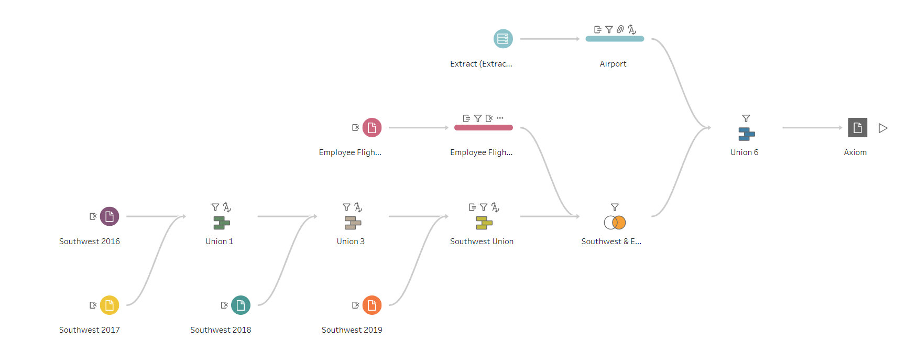

# Employee Business Travel Analysis - Axiom Inc.

## Project Overview

This project provides a comprehensive analysis of business travel data for employees at Axiom Inc. Using Tableau, we have created a detailed visualization to understand travel patterns, expenses, and trends over the years. This analysis helps in identifying cost-saving opportunities and optimizing travel policies.

## Project Files

- **Employee Business Travel (Axiom Inc.).twbx**: Tableau workbook containing the complete visualization project.
- **Employee_airline_travel.xlsx**: Excel file with detailed data on employee airline travel.
- **Final.hyper**: Hyper file used in the Tableau workbook for efficient data extraction and analysis.
- **Southwest 2016.csv**: CSV file with Southwest airline travel data for the year 2016.
- **Southwest 2017.csv**: CSV file with Southwest airline travel data for the year 2017.
- **Southwest 2018.csv**: CSV file with Southwest airline travel data for the year 2018.
- **Southwest 2019.csv**: CSV file with Southwest airline travel data for the year 2019.
- **Axiom Inc.tflx**: Tableau file containing specific analysis for Axiom Inc.
- **Employee Airline Travel.xlsx**: Another Excel file variant with employee airline travel data.
- **Airports.hyper**: Hyper file containing airport data used in the Tableau workbook.
- **Dataflow.png**: Visual representation of the data flow and connections used in the Tableau workbook.

## Data Flow Diagram

The data flow diagram above illustrates the integration of various data sources into the Tableau workbook. Each file contributes to the overall analysis by providing different dimensions and metrics for a comprehensive understanding of the business travel patterns.

## Analysis Goals

1. **Travel Patterns**: Understanding the frequency and destination of employee travel.
2. **Expense Analysis**: Identifying the cost incurred for travel and finding patterns in spending.
3. **Trend Analysis**: Observing travel trends over the years to make data-driven decisions.
4. **Cost Optimization**: Highlighting areas where travel expenses can be reduced without impacting business operations.

## Key Metrics and Insights

- **Average Ticket Price**: The mean cost of a single airline ticket across all travels.
- **Average Travel Frequency**: The average number of trips taken by an employee within a given timeframe.
- **Average Travel Buffer**: The typical time cushion between the booking date and the travel date.
- **Insurance Rate**: The percentage of trips that included travel insurance.
- **Employee Travel Cost**: The total expenditure on travel per employee.
- **Economy vs. Business Travel**: Comparison of costs and frequency between economy and business class travels.
- **Airlines with Costs**: Analysis of different airlines used and their associated travel costs.
- **Employee Travel Frequency**: Detailed breakdown of how often employees travel.
- **Employee Travel Buffer**: Insights into the planning period employees have before their travel.
- **Airlines and Fare Type vs. Ticket Price**: Correlation between the airline, fare type (economy, business), and the ticket prices.

## Getting Started

To explore the visualization:

1. Download the Tableau workbook file (`Employee Business Travel (Axiom Inc.).twbx`).
2. Open the file in Tableau Desktop.
3. Navigate through the various dashboards and sheets to explore the analysis.
4. Alternatively, view the Tableau workbook online using the following link: [View Tableau Workbook](https://public.tableau.com/app/profile/shubham.chandra3232/viz/EmployeeBusinessTravelAxiomInc_/AxiomInc_?publish=yes).

## Data Sources

- **Employee Airline Travel Data**: Provides detailed records of employee flights, including dates, costs, destinations, and airlines.
- **Southwest Airlines Data**: Specific travel data from Southwest Airlines for the years 2016-2019.
- **Airport Data**: Contains information about airports used in the analysis to enhance geographical insights.

## How to Use

1. **Open Tableau Workbook**: Use Tableau Desktop to open the `Employee Business Travel (Axiom Inc.).twbx` file.
2. **Interactive Dashboards**: Navigate through the interactive dashboards to explore various aspects of the data.
3. **Filter and Drill-Down**: Use filters to drill down into specific time periods, departments, or other dimensions of interest.
4. **Insights and Recommendations**: Utilize the insights from the visualizations to make informed decisions on travel policies and expense management.

## Contact

For any queries or further information, please reach out to:

- **Name**: Shubham Chandra
- **Email**: shubhamchandrawork@gmail.com
- **LinkedIn**: [Shubham Chandra](https://linkedin.com/in/schandra235)
- **GitHub**: [Shubham235Chandra](https://github.com/Shubham235Chandra)

---

Feel free to contribute to this project by forking the repository, making improvements, and submitting pull requests. Your contributions are welcome!
